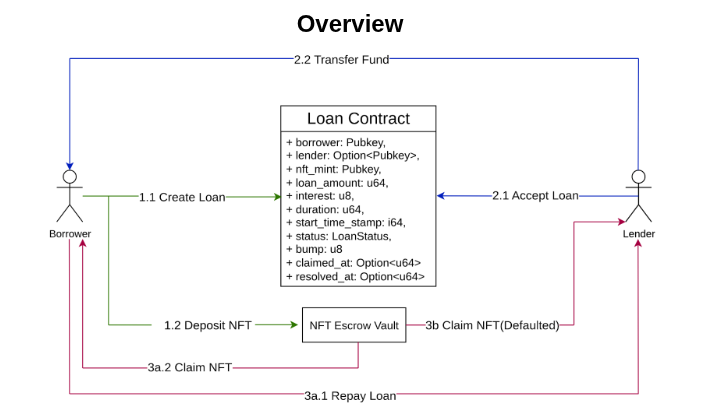

# Credentia – P2P NFT Lending Platform

**Credentia** is a peer-to-peer NFT lending protocol built on **Solana**, enabling NFT holders to unlock liquidity without selling their assets. Borrowers can use NFTs as collateral to receive tokens like SOL or USDC(in V2), while lenders earn interest or acquire the NFT if the borrower defaults. The platform focuses on **full loan customizability**, **support for long-tail NFTs**, and **low fees**, creating a more inclusive and efficient DeFi lending ecosystem.

---

## 🚀 Overview & Purpose
Credentia empowers NFT holders to:
- **Borrow** against NFTs without liquidating them.
- **Access liquidity** for trading, real-life expenses, or participating in mints.
- **Maintain asset ownership** while leveraging financial flexibility.

Lenders can:
- Earn **competitive yields** through NFT-backed loans.
- Acquire NFTs at a discount in case of borrower default.
- Operate in a **trustless, decentralized** environment with Solana’s speed and low fees.

---

## 🎯 Core Value Proposition
- **Customizable Loans** – Flexible terms for both borrowers and lenders.
- **Broad NFT Support** – Not limited to blue-chip collections; supports mid-tier and niche NFTs.
- **Low Transaction Costs** – Powered by Solana’s low fees and high throughput.
- **Decentralized Matching Engine** – Direct borrower-lender negotiation without centralized pools.

---

## 📌 Target Markets
1. **Retail NFT Holders on Solana** – Unlock liquidity without selling NFTs.
2. **DeFi-native Lenders & Yield Farmers** – Earn interest or strategically acquire NFTs.
3. **NFT Collectors & Snipers** – Target high-value NFTs for potential discounted acquisition.
4. **Treasury Managers & NFT Guilds** – Leverage lending for treasury growth.

---

## 🛠 Architecture
The protocol follows a **trustless flow** with on-chain smart contracts handling collateralization, loan disbursement, repayments, and defaults.

**High-level flows**:

1. **Loan Initialization**  
   - Borrower deposits NFT into smart contract.
   - NFT verified for collection, ownership, and metadata.

2. **Loan Acceptance**  
   - Lender reviews and accepts loan terms.
   - Loan funds sent to borrower; NFT held in escrow.

3. **Repayment Flow**  
   - Borrower repays principal + interest before deadline.
   - NFT automatically returned.

4. **Post-Default Recovery**  
   - If borrower defaults, lender claims NFT from escrow.

5. **High-level Overview**:
    - *Refer to the [Architectural Diagram](https://drive.google.com/file/d/1yjoqR-41TfxrJ2o6-15NEsTWsjUzZfTL/view?usp=sharing) for detailed visuals.*

<p align="center">
  
</p>


---

## 📂 Repository Structure

```
├── programs/ # Solana smart contracts (Rust + Anchor)
├── migrations/ # Program deployment scripts
├── tests/ # Protocol test cases
├── Anchor.toml # Anchor config
├── Cargo.toml # Rust dependencies
├── package.json # Frontend dependencies
└── README.md # Project documentation
```


---

## ⚙️ Tech Stack
- **Blockchain**: Solana
- **Smart Contracts**: Rust + Anchor Framework
- **Frontend**: TypeScript, React
- **Wallet Integration**: Phantom, Solflare
- **Token Standards**: SPL Tokens, Metaplex NFTs

---

## 📜 Installation & Setup
1. **Clone the Repository**
   ```bash
   git clone https://github.com/Dev050x/Credentia.git
   cd Credentia

2. **Install Dependencies**
    ```bash
    npm install
3. **Build Smart Contracts**
    ```bash
    anchor build
4. **Deploy to Devnet**
    ```bash
    anchor deploy
## Deployed Program
1. **Progam Id**
    ```bash
    74RfkJTR8xAGJZZfapADruyj8rfvAv1qQpaz2pVfFxdb
2. IDL: 
    ```bash
    EGVwbaqAXaGUZ9E62HbDgHZp1XJZNp33eJ6MkX8zoSmt
